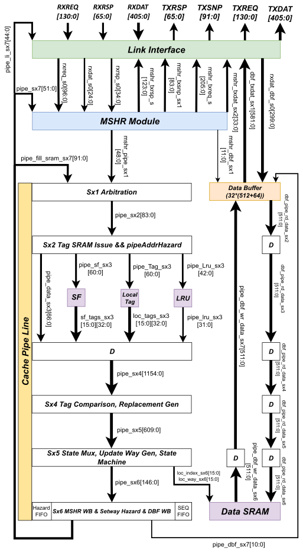

#  HNF 功能概述
&emsp;&emsp;本项目所包含的 HN-F （后简称 HN-F）实现了 CHI 协议所规定的 POC (Point of Coherence) 和 PoS (Point of Serialization) 功能（详见CHI e.b 协议 1.6）。其内部包含了一个容量可配置的 LLC 缓存，以及一个可以减少发送 SNP 报文数量的 Snoop Filter (SF)。HN-F 支持的其他功能如下如下：

1. 下表中的 CHI Transaction
2. CHI 协议中的 UC、SC、UD、I 缓存行状态
3. Exclusive access
4. QoS

### 支持的CHI Transaction 列表
- ReadNoSnp
- ReadOnce
- ReadClean
- ReadNotSharedDirty
- ReadUnique
- CleanUnique
- MakeUnique
- CleanShared
- CleanInvalid
- WriteNoSnpPtl
- WriteNoSnpFull
- WriteCleanFull
- WriteEcivtFull
- WriteBackFull
- Evict
- WriteUniqueFull
- WriteUniquePtl

### HN-F行为
&emsp;&emsp;HN-F 接收来自 RXREQ 通道的 Req 报文。每个收到的 Req 报文对应一个 Transaction，一个 Transaction 可能包括多个 Rsp、Snp 和 Dat 报文。HN-F 配合 RN 和 SN-F 完成整个 Transaction。

可以将 HN-F 视为一个状态机，其行为如下：

1. 读取和更新内部缓存数据和状态（包括 LRU）
2. 读取和更新 SF
3. 读取和更新 Exclusive Monitor
4. 读取和更新 QoS（包括内部仲裁相关寄存器）相关寄存器
5. 发送 Req，Rsp，Snp 和 Dat 报文

HN-F 选择在某一时间完成某一种行为是根据其内部状态和收到的报文决定的，这里并没有将状态和行为之间的联系描述完全：

1. 缓存块状态决定发哪种类型报文以及缓存块更新状态，缓存块数据决定 Dat 报文 Data 字段内容
2. SF 内容决定发送 Snp 报文的字段和数量等
3. Exclusive Monitor 决定 RespErr 字段内容等
4. QoS 相关寄存器决定某个报文何时发出等
5. 收到的 Req，Rsp，Dat 报文决定 Transaction 流程（这一过程也是通过修改 MSHR 状态位实现的）

### HN-F 组件结构

HN-F 包括一下五大组成部分。下图为 HN-F 数据通路：

（1）Link Interface

&emsp;&emsp;LI (Link Interface) 包括了 HN-F 与外部交互的接口，实现基于 CHI 协议通道规范的 Flit（CHI 协议报文）的发送与接收。LI 的四对外通道为：RXREQ, RXRSP, RXDAT, TXREQ, TXRSP, TXSNP, TXDAT.LI 的主要功能为协议规定的 Network Layer 的组包功能以及 Link Layer 的 flow control 功能(14.2)。此外它还负责仲裁 HN-F 内部不同来源的报文发送请求，并进行 RX 通道的解包。

(2) MSHR

&emsp;&emsp;MSHR 是 HN-F 的控制中心。其接受来自 LI 的报文、BIQ (Back Invalidation Queue) 的请求以及 Cache Pipeline 返回的结果，修改其内部的控制位。每周期，MSHR 只根据其内部控制位状态决定其行为：向 Cache Pipeline 发送读取或更新 LLC、SF 的请求，以及向 LI 发送向外发送报文的请求。

&emsp;&emsp;MSHR 内部存储结构是一个有多个 MSHR Entry （MSHR 项）的寄存器堆，每个 Transaction （以及其带来的替换 Transaction）对应其中一项。每项包括所有 Transaction 需要的控制位，以及 Transaction 本身的部分信息，如 SrcID 和地址。这样使得 MSHR 能同时处理多个 Transaction。Req 到来时，根据 QoS 决定能否进入 MSHR。

&emsp;&emsp;由于并行的存在，为了实现 PoC 和 PoS 功能，MSHR 也包括一个冲突处理机制：休眠同一地址后来的 Transaction，直到先来的 Transaction 完成。

&emsp;&emsp;由于 LI 对外通道和 Cache Pipeline 每周期只能完成一个 Transaction 对应的操作，MSHR 也实现了向这些结构的仲裁功能。

(3) Data Buffer

&emsp;&emsp;DBF (Data Buffer) 是一个寄存器堆，和 MSHR 项数量一样，一一对应。其每一项包括数据和 Byte Enable（含义同协议中的 BE）。DBF 的功能是暂存 Transaction 内部涉及的数据。当数据从 LLC 读出后或从 RXDAT 到来时，会写入 DBF；当需要写 LLC 或由 RXDAT 发送数据时，读 DBF。交换数据见 CaChePipeLine文档。

(4) SRAM

&emsp;&emsp;HN-F 的 SRAM 用于存贮 L3 数据和状态，以及 SF 内容，用于支持 CPL 的两大功能：

1. 一个一致的的 L3 缓存
2. 减少发出的 Snp 报文数量

&emsp;&emsp;第一个功能依靠 Data SRAM 存储数据，Tag SRAM 维护一个 Cache Line 和物理地址的对应关系和这一 Cache Line 在 L3 中的状态，LRU SRAM 记录不同 Way 的访问历史信息，用于确定替换的路。第二个功能依靠 SF SRAM。其每一个 Cache Line 描述了其对应的物理地址对应的数据在 RN-F 所有可能状态的集合。如果某个地址 SF SRAM 不命中且 BIQ 不命中，则可以认为该地址对应的数据不存在任何 RN-F 的缓存中。

&emsp;&emsp;HN-F 设计所使用的 SRAM 均为单口 SRAM。其读写均为一拍完成。读请求在 T0 开始时刻进入 SRAM，T1 开始时刻读数据可用。写请求及写数据在 T0 开始时刻进入 SRAM，T1 开始时刻写数据即可被读取。

(5) CachePipeLine

&emsp;&emsp;CPL (Cache Pipeline) 负责更新 L3 数据状态和 SF。CPL 为一个多级无阻塞流水线，每周期接受来一个自 MSHR 的请求，并向 MSHR 返回一个前面请求的结果。CPL 仅从 MSHR 接受少量其需要的报文字段和控制位，并向 MSHR 返回 MSHR 需要的 L3 状态和要发送 Snp 报文文数量目标等信息。

&emsp;&emsp;CPL 连接除 Data SRAM 数据端口以外的所有 SRAM 端口，负责这些 SRAM 的读写，以及新的状态的计算。

CPL 通过 hazard 机制保证了缓存块状态和 SF 的更新是原子的。由于 SRAM 的读和写之间存在一定的间隔，在一个 Cache Line 读取后写入前可能存在另一个读请求，且这个读请求可能想要修改和前面请求同样的 Set 和 Way。CPL 的 Hazard 机制通过给后面请求标记 retry，避免后面的请求读出过时的信息。

&emsp;&emsp;由于 Silent Evict 的存在，CPL 也包括一个 BIQ(Back Invalidation Queue)。用于在 SF 满且未命中产生替换，SF 已更新但 RN-F 没有被真正 Invalidate 时，记录被替换的 Cache Line 对应的地址。

&emsp;&emsp;这样针对被 SF 替换的地址的需要 Snoop 的请求命中 BIQ 时选择组播，避免漏掉一个仍然缓存了该地址的 RN-F。

